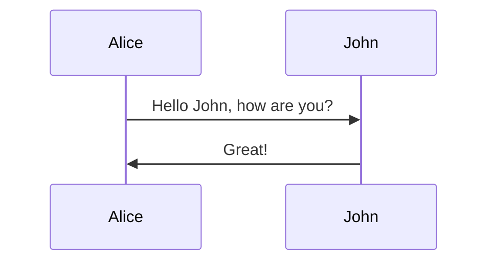
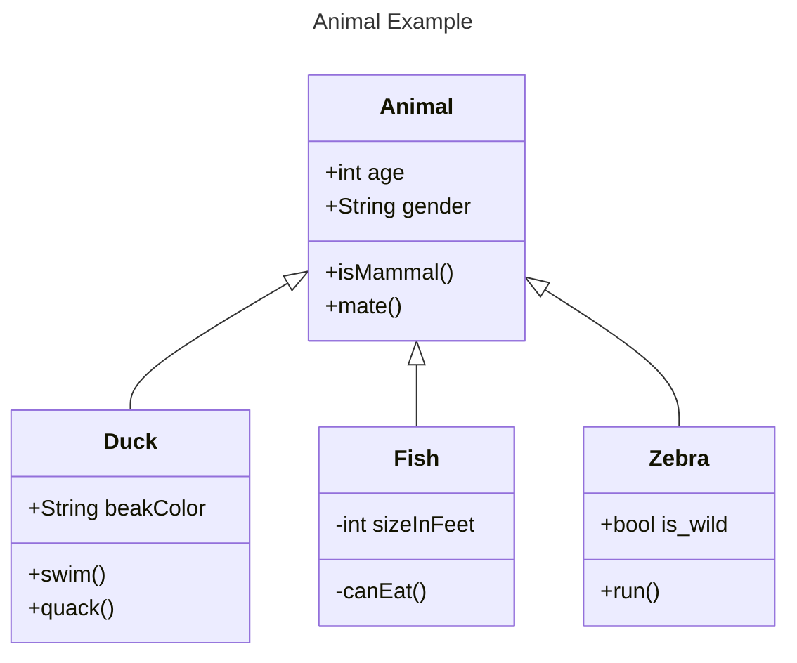
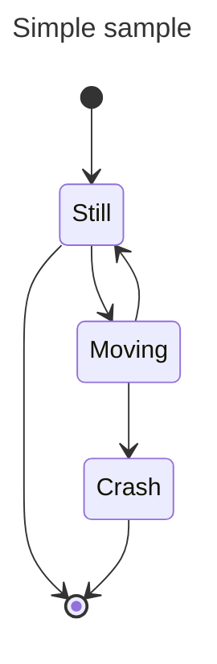
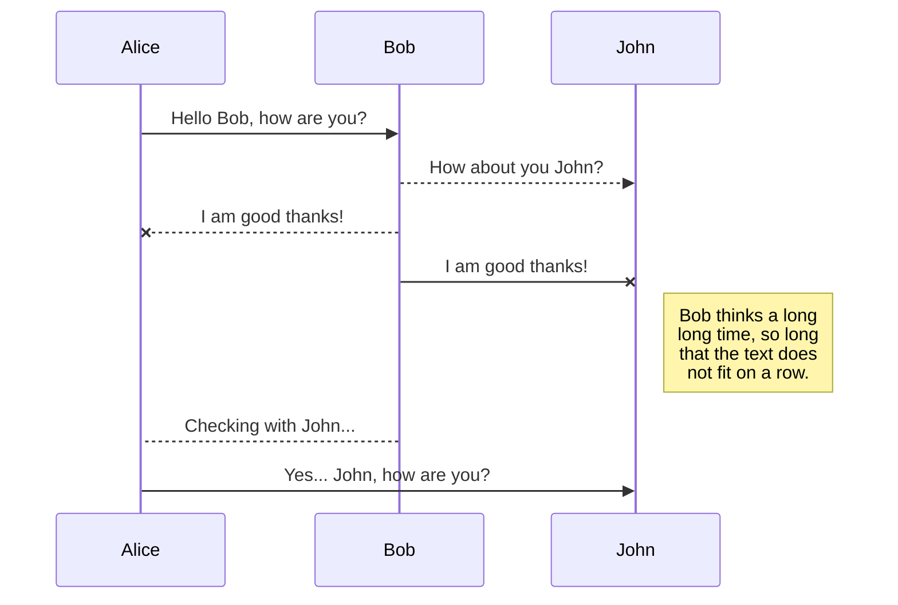

# Demo H1 header


```
$ git init
Initialized empty Git repository in /Users/skills/Projects/recipe-repository/.git/
```

``` javascript
var myVar = "Hello, world!";
```

- [ ] Turn on GitHub Pages
- [ ] Outline my portfolio
- [ ] Introduce myself to the world








